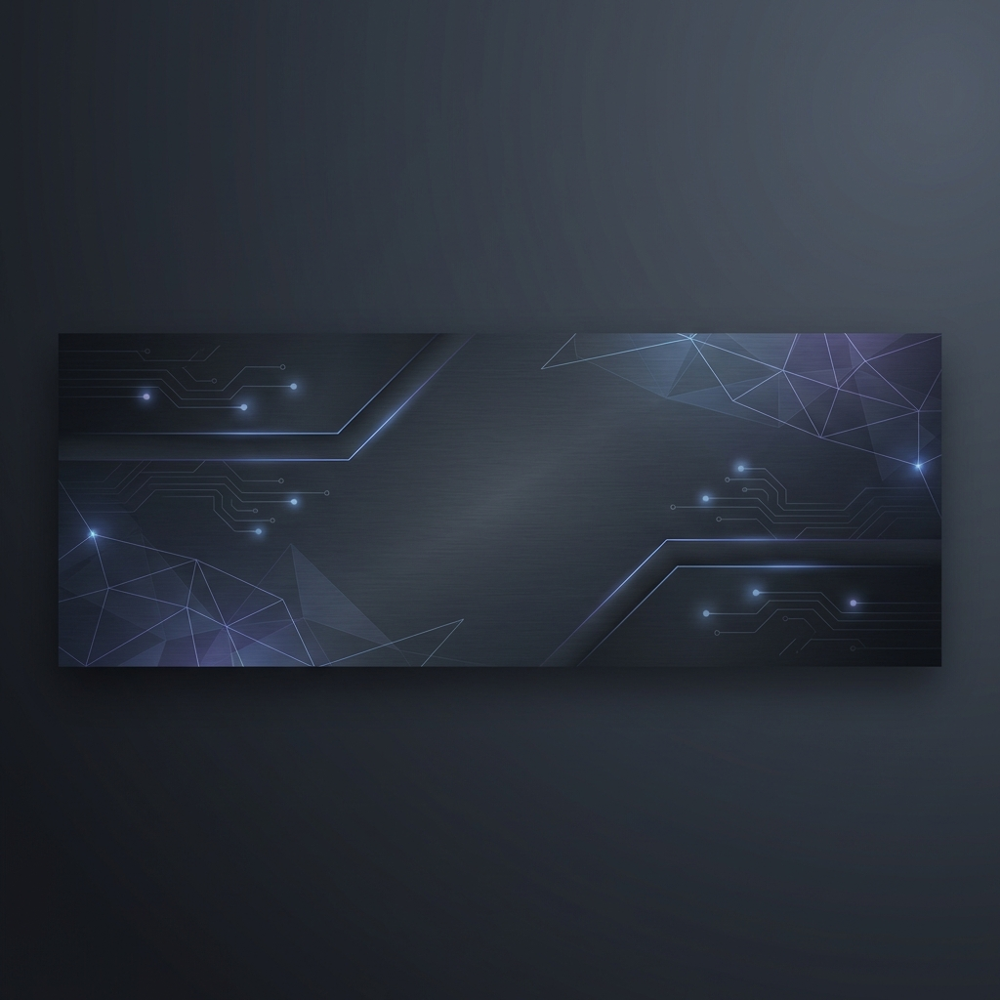

# Hi there, I'm Ali Ahmed 👋

  

  

---

### 💫 About Me
I'm a passionate **Full Stack Developer** dedicated to building high-quality, responsive, and visually stunning web applications. With a focus on clean code and user-centric design, I love turning complex problems into simple, elegant solutions.

- 🔭 I’m currently working on **Modern Web Solutions**
- 🌱 I’m currently learning **Advanced System Design & Distributed Systems**
- 👯 I’m looking to collaborate on **Open Source Projects**
- 💬 Ask me about **JavaScript, React, Tailwind, and Node.js**
- 📫 How to reach me: **[your-email@example.com]**

---

### 🏆 GitHub Trophies

  

---

### 🚀 Tech Stack

| Category | Tools & Technologies |
| :--- | :--- |
| **Frontend** | `React`, `Next.js`, `Tailwind CSS`, `TypeScript`, `Redux` |
| **Backend** | `Node.js`, `Express`, `PostgreSQL`, `MongoDB`, `Redis` |
| **DevOps** | `Docker`, `GitHub Actions`, `AWS`, `Vercel`, `Linux` |
| **Design** | `Figma`, `Adobe XD`, `Canva` |

 

  

---

### 📊 GitHub Stats

  
  

 

  

---

### 🎨 Contribution Snake

  

> **Note:** To enable the snake animation, you'll need to set up a GitHub Action. I've prepared the workflow for you below!

---

### 🤝 Connect with Me

 

  

